# R&#926;S&#945; 971 | Réservation de véhicule en ligne

Grâce à votre action quotidienne, le parc automobile de la Gendarmerie Nationale s'enrichie des véhicules saisis aux délinquants.

En retour, la Gendarmerie a choisi de mettre ces véhicules à votre disposition, afin de faciliter la réalisation de vos différentes missions, qu'elles soient d'ordre opérationel ou non.

Ce guide a pour but de vous accompagner dans l'utilisation du site internet de réservation, sur lequel vous pourrez également trouver les véhicules proposés par notre CSAG. 

## Périmètre de réservation

Le périmètre de réservation pour le pool de véhicules est fonction de l'unité bénéficiaire: 
- ainsi, votre **compagnie**, **SR**, **EDCF** ou **AGIGN** procèdera, à votre profit, à la réservation d'un véhicule si votre unité fait partie de son périmètre ou si votre cellule / groupe d'enquête y est rattaché,
- les personnels des unités **MPF**, **GIR** et **BGTA** sont autonomes pour procéder à des réservations,
- enfin, les personnels des unités SOLC, SAJ et BOE devront s'adresser à la **SAJ** ou à l'**OAPJR 1 et 2** pour leurs réservations.

Par conséquent, vous rencontrerez peut-être un message d'erreur si vous essayez de vous connecter directement au site et que vous n'êtes pas autorisés à procéder aux réservations par vous-même. 

## Accès au site

L'application est accessible à l'adresse [https://comgend971.local.gendarmerie.fr/resa971](https://comgend971.local.gendarmerie.fr/resa971).

Vous pouvez également la trouver depuis le [silo](https://glp.publi.gendarmerie.fr).

## Table des matières

- RΞSα 971
  - [Périmètre de réservation](#périmètre-de-réservation)
  - [Accès au site](#accès-au-site)
  - [Sommaire](#sommaire)
  - [Profils utilisateur](#profils-utilisateur)
  - [Quel que soit votre profil](#quel-que-soit-votre-profil)
    - [PAGE D'ACCUEIL](#page-daccueil)
    - [EN-TÊTE](#en-tête)
    - [FILTRES DE RECHERCHE](#filtres-de-recherche)
      - [Filtres de **début** et de **fin**:](#filtres-de-début-et-de-fin)
      - [Filtre de catégorie:](#filtre-de-catégorie)
      - [Autres filtres](#autres-filtres)
  - [Utilisation en tant qu'utilisateur](#utilisation-en-tant-quutilisateur)
    - [Choix d'un véhicule](#choix-dun-véhicule)
    - [Page de réservation](#page-de-réservation)
      - [Processus de réservation](#processus-de-réservation)
      - [Attente de validation](#attente-de-validation)
      - [Demande de réservation validée](#demande-de-réservation-validée)
  - [Utilisation en tant que valideur](#utilisation-en-tant-que-valideur)
    - [Distinctions selon le type de demande](#distinctions-selon-le-type-de-demande)
    - [Processus de validation d'une réservation](#processus-de-validation-dune-réservation)
      - [Supprimer la demande:](#supprimer-la-demande)
      - [Modifier la demande:](#modifier-la-demande)
      - [Valider la demande](#valider-la-demande)
  - [Utilisation en tant que CSAG](#utilisation-en-tant-que-csag)
    - [Gestion des horaires de l'atelier](#gestion-des-horaires-de-latelier)
      - [Modification d'horaire](#modification-dhoraire)
    - [Gestion du parc](#gestion-du-parc)
      - [Ajout, modification ou suppression d'un véhciule](#ajout-modification-ou-suppression-dun-véhciule)
      - [Suivi des véhicules](#suivi-des-véhicules)
    - [Tableau de bord](#tableau-de-bord)
      - [Affichage journalier](#affichage-journalier)
      - [Affichages hebdomadaire et mensuel](#affichages-hebdomadaire-et-mensuel)
    - [Validation des demandes de réservation](#validation-des-demandes-de-réservation)
  - [Licence](#licence)
  - [Contact](#contact)

## Profils utilisateur

Le site compte 4 profils utilisateurs différents:
1. [UTILISATEUR](#utilisation-en-tant-quutilisateur)
2. [VALIDEUR](#utilisation-en-tant-que-valideur)
3. [CSAG](#utilisation-en-tant-que-csag)
4. ADMINISTRATEUR (SOLC)

Comme pour la plupart des applications métier de la Gendarmerie, la première action qui vous sera demandée sera de vous connecter via le portail SSO:

Après vous être connecté, et à l'exception du profil "valideur" qui est attribué manuellement par les SOLC/DSOLC, votre profil utilisateur sera déterminé en fonction de l'unité dans laquelle vous servez.

## Quel que soit votre profil

### PAGE D'ACCUEIL

Après vous être connecté, vous accédez à la page d'accueil, toujours accessible via l'onglet "Recherche".

### EN-TÊTE

L'en-tête (Header) du site comprend **le nom du site**, sur lequel vous pouvez cliquer à tout moment pour revenir à l'accueil.

Vous trouverez aussi, en haut à droite, un **bouton de déconnexion**.

Dessous, trois onglets:
- onglet **Recherche** (page d'accueil),
- onglet **Historique**: pour retrouver vos demandes de réservation, passées ou à venir,
- onglet **Compte**: pour retrouver toutes les actions possibles sur le site, en focntion de votre profil.

### FILTRES DE RECHERCHE

Dans la partie principale (Main) de la page, vous trouverez des filtres de recherche, vous permettant de cibler un véhicule particulier:

#### Filtres de **début** et de **fin**: 

Attention, ces filtres ne vous permettent pas de réserver un véhicule à une date particulière! Leur utilisation vous permet de ***trouver un véhicule qui n'est pas réservé*** pendant la période que vous définissez.
  
#### Filtre de catégorie:

Selon les types de carrosseries disponibles, ce filtre vous permettra de trouver le véhciule le plus adapté à votre mission.

#### Autres filtres

Vous pouvez rechercher selon des criètes plus spécifiques, tes que:
- l'unité où est localisé le véhicule,
- la présence d'une **sérigraphie** ou non,
- le **nombre de places minimum** que doit compter le véhicule,
- le type de **transmission**.

## Utilisation en tant qu'utilisateur

### Choix d'un véhicule

Comme vous pouvez le voir, chaque véhicule proposé à la réservation apparaît sous la forme d'une carte.

Vous trouverez sur chaque carte:
- la photo du véhicule,
- la marque et le modèle,
- la finition ou des caractéristiques techniques majeures
- 3 tags décrivant:
    - l'unité où se trouve le véhicule,
    - le type de transmission (automatique ou manuelle)
    - le type de carburant
- plusieurs symboles pour connaître le nombre de places à bord (autant de "petits bonhommes" que de places).

#### Restrictions d'usage

Certains véhicule peuvent faire l'objet de restrictions dans leur utilisation:

- Atelier: le véhicule est en réparation, il n'est PAS visible sur le site,
- **Avant jugement**: l'utilisateur s'engage (plusieurs rappels sont faits au cours du processus de réservation) à ne pas utiliser le véhicule dans le cadre d'une mission opérationnelle. Le véhicule peut être employé dans le cadre de liaisons, principalement.
- État-Major: la visibilité de certains véhicules peut être restreinte aux seules unités état-major.

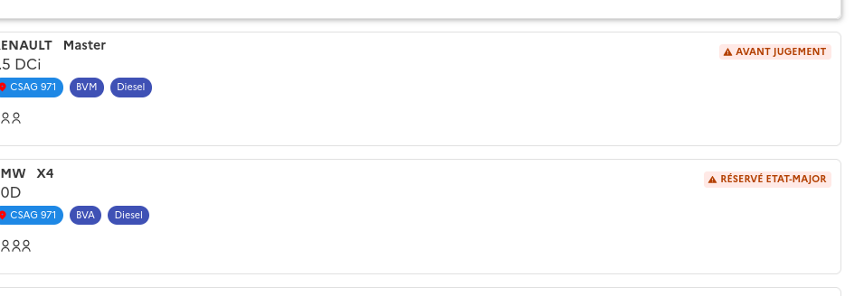

### Page de réservation

Après avoir cliqué sur la carte du véhicule de votre choix, sa page de réservation dédiée s'affiche.

Cette page vous présente davantage de photos du véhicule s'il y en a, des caractéristiques plus détaillées et surtout: un **calendrier de réservation**.

#### Processus de réservation

1. Cliquez sur la date à laquelle vous voulez que votre réservation débute:

2. Une fenêtre surgissante (modale) s'ouvre afin de sélectionner l'heure de début de la réservation. Le choix des heures proposé tient compte des horaires du CSAG.

3. Cliquez sur la date à laquelle vous voulez que votre réservation se termine, puis renseignez l'heure de restitution:

4. Le récapitulatif des dates de début et de fin de réservation a été mis à jour en fonction de vos choix. Cliquez sur le bouton "**Je réserve**" pour confirmer votre demande.

5. Une dernière modale s'ouvre alors, et vous invite à préciser:
    - l'usage que vous comptez faire du véhicule (opérationnel ou non),
    - vos observations. Ce champs est facultatif mais il permettra à votre valideur d'apprécier l'opportunité de votre demande. Il vous appartient donc d'être exhaustif!

6. Après avoir confirmé votre demande, une page vous indique que celle-ci est désormais en **attente de validation**.

#### Attente de validation

À ce stade, votre demande de réservation a bien été enregistrée et le véhicule demandé n'est plus proposé aux autres utilisateurs.

**Toutefois**, tant que votre demande n'a pas été validée, le véhicule ne vous est pas réservé. Bien qu'il n'apparaisse plus comme disponible aux dates que vus avez demandées, le valideur peut l'attribuer à quelqu'un d'autre, et peut même annuler complètement votre demande!

**RENDEZ-VOUS DANS L'ONGLET "HISTORIQUE" POUR SUIVRE L'ÉVOLUTION DE VOTRE DEMANDE. CELLE-CI DEVRAIT PASSER DU STATUT "EN ATTENTE" À "VALIDÉE".**

#### Demande de réservation validée

Si votre demande a été validée, le véhicule vous est réservé et sera disponible à la date et l'heure de début prévue, dans la cour du CSAG. 

- Les clés seront perçues et réintégrées au CSAG,
- Les véhciules d eprêt doivent être correctement entretenus par l'unité bénéficiaire, et l'entretien de premier niveau doit être réalisé avant restitution,
- Les véhicules doivent être restitués propres pour pouvoir être perçus dans le même état par l'unité suivante, avec le plein de carburant effectué.

À défaut, la réintégration  sera refusée et l'unité en cause devra réaliser l'entretien dans les locaux du CSAG le jour même. Une récurrence de défaut d'entretien pourra conduire à une exclusion temporaire de l'accès au pool.

## Utilisation en tant que valideur

À l'instar de l'[utilisateur](#utilisation-en-tant-quutilisateur), le valideur peut effectuer une demande de réservation (onglet "Recherche") et suivre son historique (onglet "Historique").

Nous nous intéresserons donc à l'onglet "Mon compte" pour ce profil.

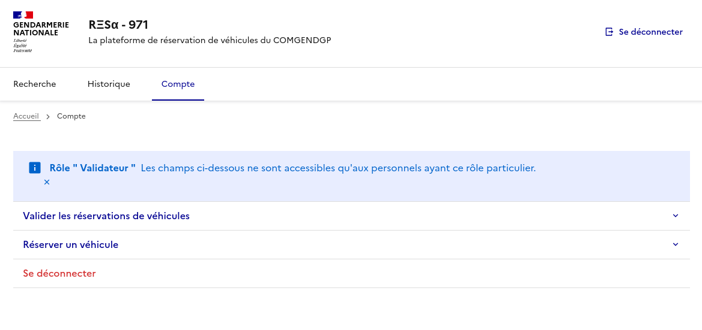

### Distinctions selon le type de demande

Le valideur d'une demande de réservation est fonction du type de demande. Il s'agit:

- du **commandant de SAJ** ou de l'**OAPJR** pour les missions opérationnelles,

- du **CSAG** pour le smissions de soutien ou de liaison.

Lorsqu'il se rend dans l'espace dédié à la validation des demandes, **le valideur ne voit que les demandes de son ressort**.

### Processus de validation d'une réservation

Pour le valideur, il suffit de passer la souris au dessus de la carte d'une demande de réservation pour afficher, via 3 boutons - icônes d'action, les commandes disponibles:

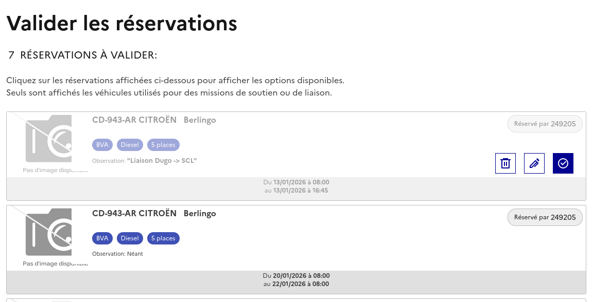

Le valideur peut alors:

#### Supprimer la demande: 

Peu impporte la raison, le valideur peut supprimer définitivement une demande de réservation. Une fenêtre s'ouvrira pour lui demander de confirmer son action.   
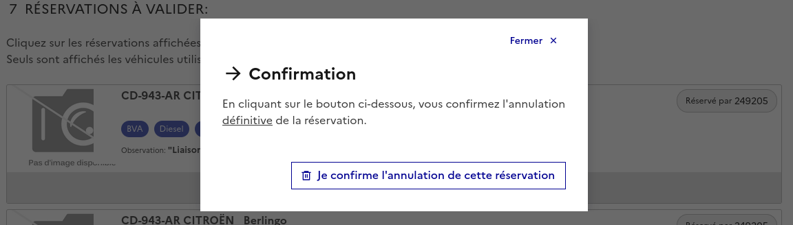
&rarr; ***Mail envoyé au demandeur*** pour lui notifier cette suppression.

#### Modifier la demande:

Le valideur a la possibilité d'attribuer un autre véhicule que celui demandé. 
Dans une fenêtre surgissante, il peut sélectionner, s'il y en a, un **autre véhicule offrant au minimum autant de places assises que le véhicule demandé** et, le cas échéant, la présence d'une sérigraphie:
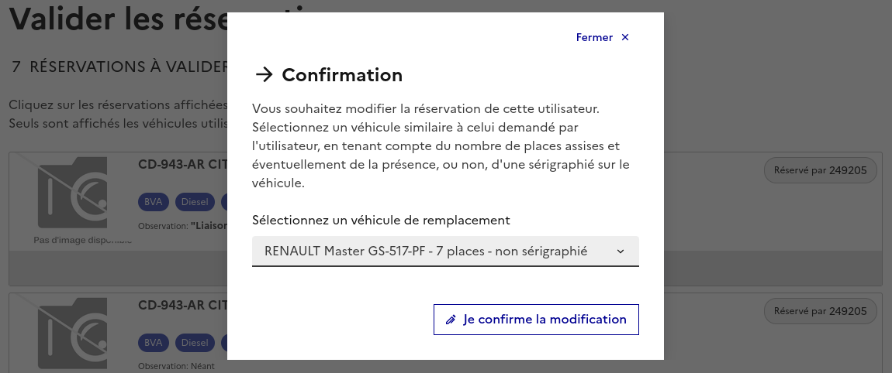

&rarr; ***Mail envoyé au demandeur*** pour l'informer que sa demande a été validée mais que le véhicule a été modifié.

#### Valider la demande

Après confirmation, la demande est validée:
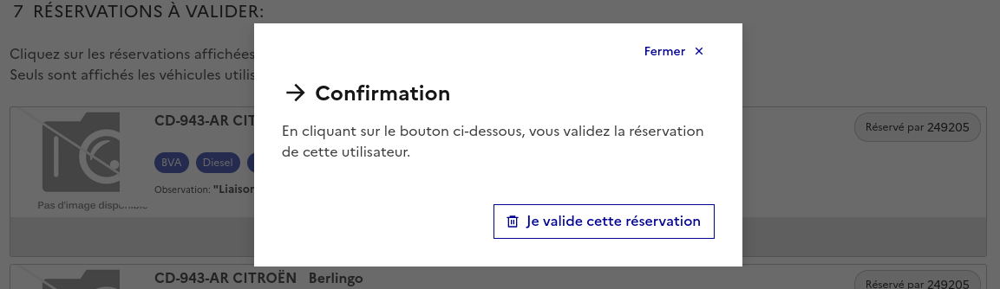
&rarr; ***Mail envoyé au demandeur***

## Utilisation en tant que CSAG

Le CSAG assure le rôle de gestionnaire du parc automobile, mais également celui de valideur pour véhicules réservés pour des missions non opérationnelles.
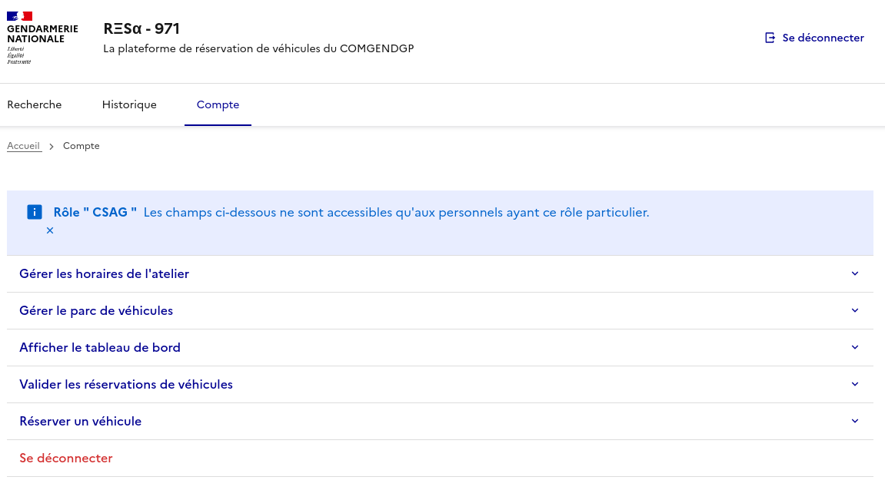

### Gestion des horaires de l'atelier

La mise à jour des horaires de l'atelier est importante, car elle conditionne les horaires de perception et réintégration des véhicules.

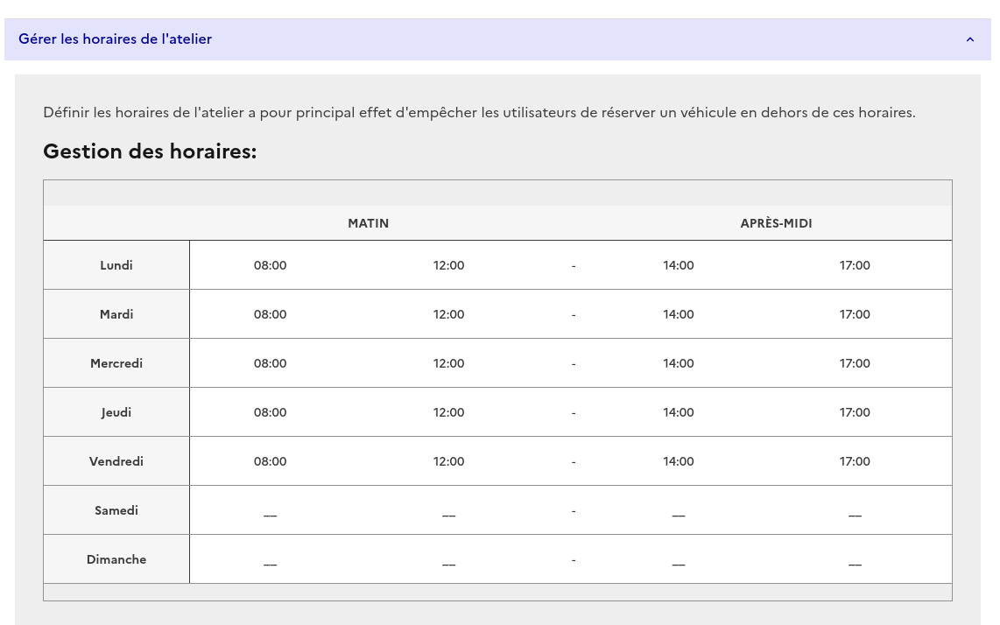

Dans l'image ci-dessus, en indiquant que le CSAG est ouvert de 08 heures à midi, puis de 14 heures à 17 heures durant les jours ouvrés, le gestionnaire s'assure de ne pas avoir à effectuer de perception ou de restitution en dehors de ces créneaux.

**NB**: Les réintégrations ne peuvent avoir lieu qu'un quart d'heure - minimum - avant la fermeture de l'atelier, afin que les personnels du CSAG n'aient pas besoin de terminer au delà de leur horaire habituel à cause de réservations prenant fin à 17 heures "pile".

#### Modification d'horaire

Il suffit de survoler le planning à l'aide de sa souris pour qu'une icône "crayon" apparaisse. En cliquant sur cette icône, s'ouvre une fenêtre surgissante permettant, au choix, d'indiquer un horaire d'ouverture / fermeture de l'atelier, voire une fermeture pour la journée entière en cliquant sur la case à cocher "Fermé".

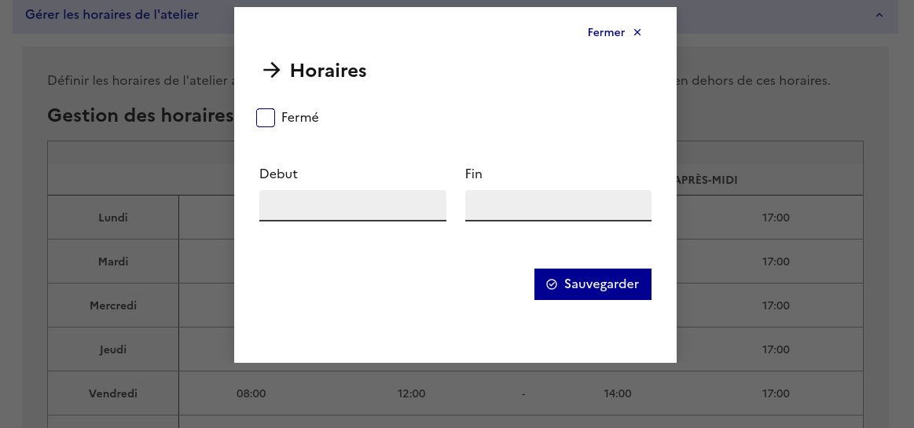

### Gestion du parc

La gestion du parc automobile incombe au CSAG.

La page dédiée à cette gestion est constituée d'un tableau récapitulatif des véhicules enregistrés dans le parc, et de 4 boutons d'action:

- Ajouter un véhicule
- Modifier un véhicule
- Supprimer un véhicule
- Suivi du véhicule
  
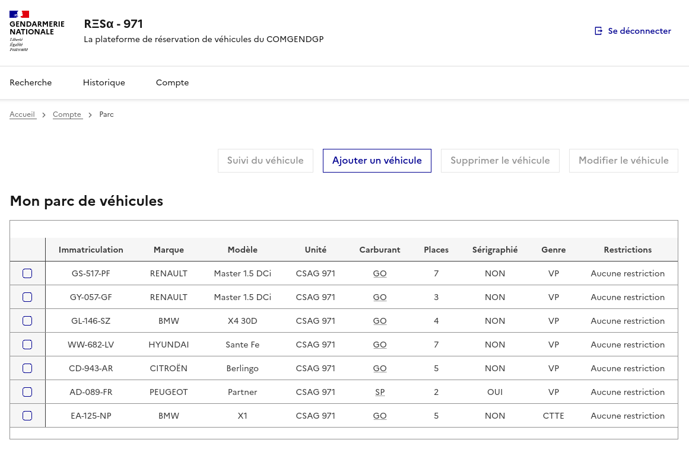

Les boutons permettant de modifier ou de supprimer un véhicule, et celui permettant de gérer le suivi sont désactivés par défaut. Il ne s'activent qu'après sélection d'un véhicule sur lequel appliquer l'action.

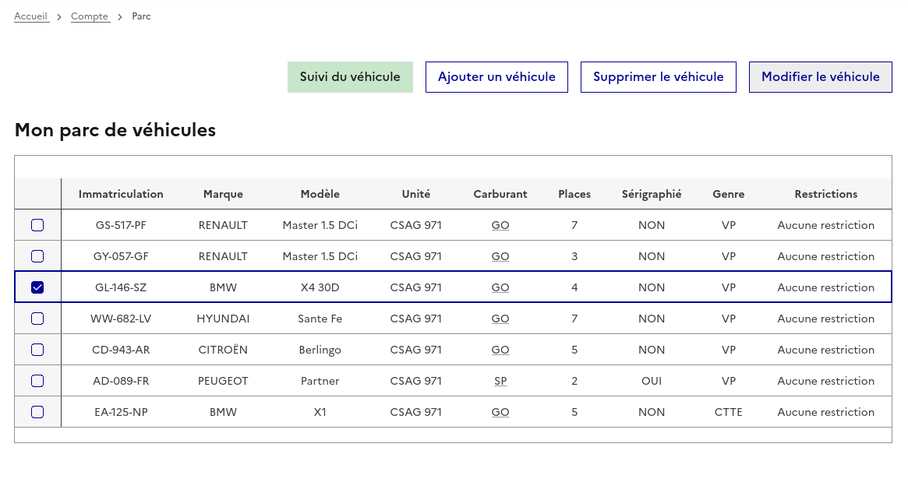

#### Ajout, modification ou suppression d'un véhciule

Les formulaires dédiés sont constitués de 3 étapes:

1. **Saisie des caractéristiques du véhicule**
   
   Seuls sont obligatoires la saisie de l'immatriculation, la marque et le modèle du véhciule. Les codes du département et de l'unité détentrices sont pré-remplis.

  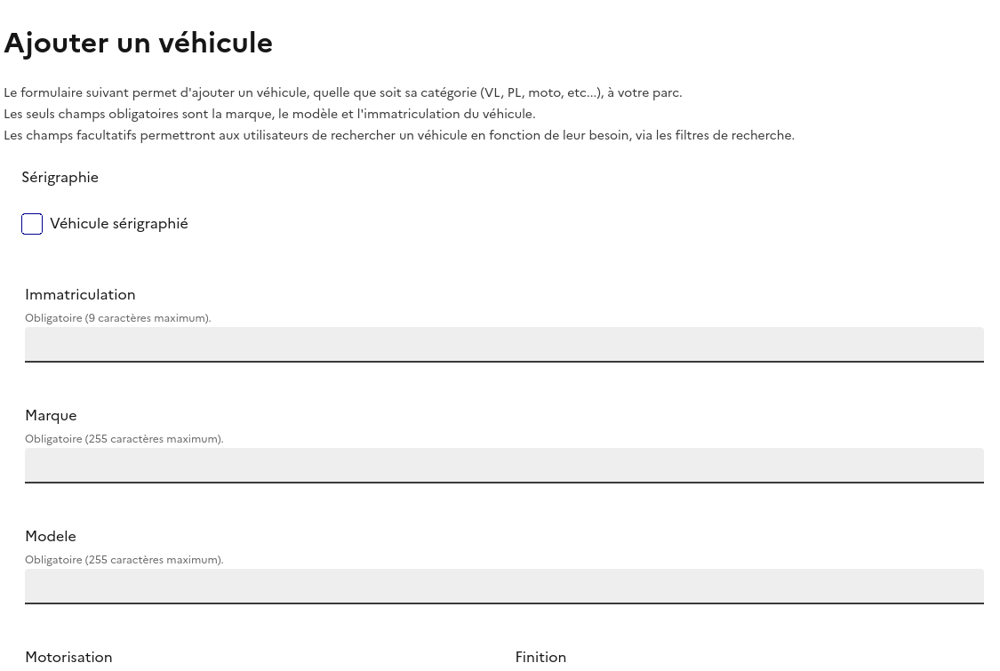

2. **Ajout de photographie(s)**
   
   Le gestionnaire peut sélectionner la ou les photos dont il dispose en cliquant sur le bouton "Parcourir". Il peut également, en scannant le QR-Code qui s'affiche sur la page, accéder à une interface pré-authentifiée via son téléphoe Néogend afin d'aller prendre des photos à l'aide de celui-ci. 
   
   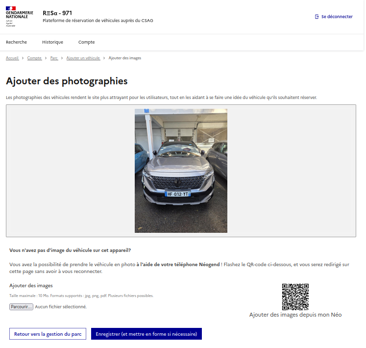

3. **Rectification de l'orientation des photos**
   
   Parfois, l'ajout de photos via le formulaire modifie leur orientation d'origine. Le plus souvent, celà concerne les photos prises à l'aide d'un mobile en orientation "portrait". Cette troisième étape permet de corriger l'orientation des photos avant de les sauvegarder.

   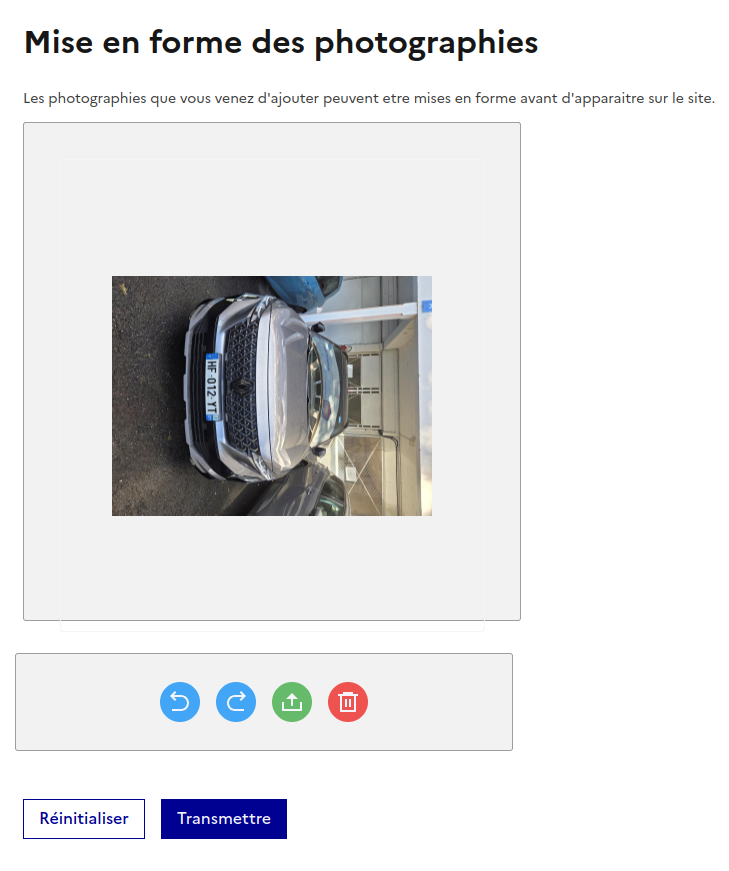

#### Suivi des véhicules 

L'écran de suivi des véhicule retrace l'historiques des réservations effectuées pour un véhicule donné. Il permet en outre d'insérer les fiches de perception et de restitution.

Les modèles de ces fiches peuvent être téléchargés depuis cette page. 

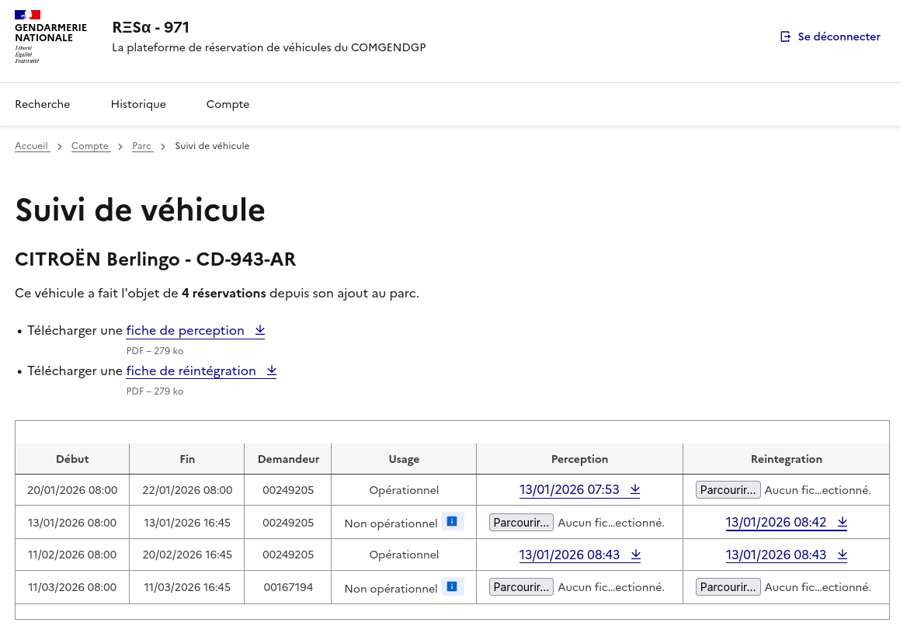

### Tableau de bord

Le tableau de bord permet au CSAG de visualiser les perceptions et réintégrations en cours ou à venir.

**NB**: certaines demandes de réservation sont affichées de manière peu lisible (effet d'opacité). **Il s'agit des demandes qui n'ont pas encore été validées**.

#### Affichage journalier

Plus détaillé que les autres types d'affichage, il permet de vérifier rapidemment les différentes perceptions et réintégrations prévues sur la journée.

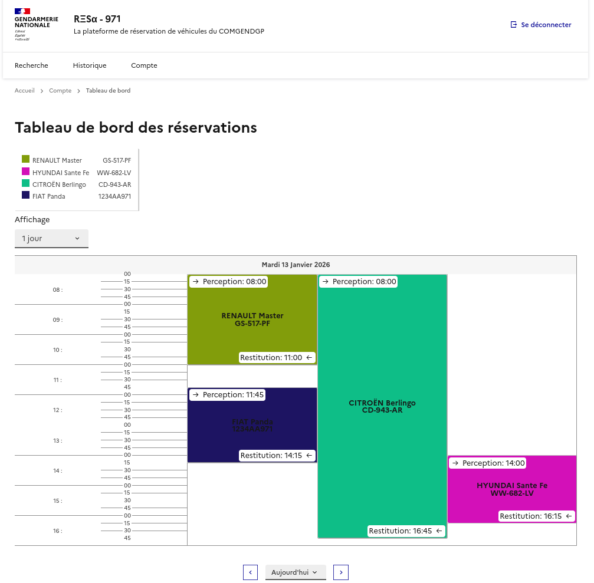

#### Affichages hebdomadaire et mensuel

ces affichages permettent d'anticiper les rendez-vous à venir.

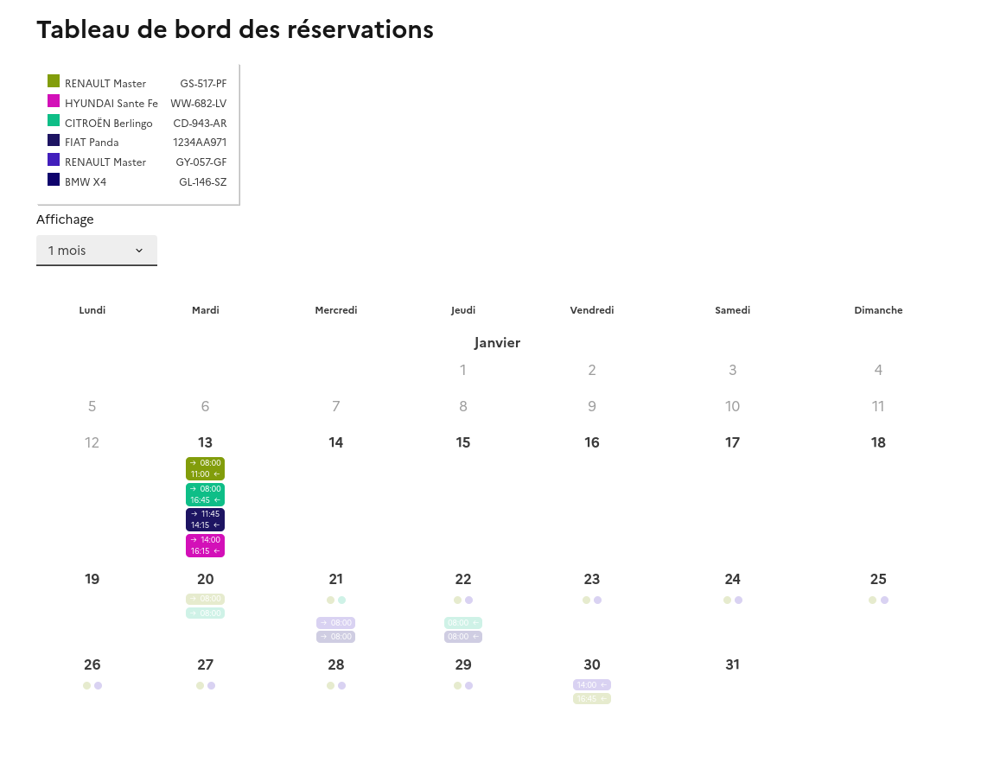

### Validation des demandes de réservation

Le processus de validation est strictement le même que pour le valideur "missions opérationnelles". Seule change la visibilité des demandes selon l'usage prévu du véhicule. En conséquence, bien vouloir vous référer à la [section relative à l'utilisation en tant que valideur](#utilisation-en-tant-que-valideur) pour cette fonctionnalité.

## Licence

Le site R&#926;S&#945; 971 utilise le <abbr title="Système de Design de l'État">Système de Design de l'État - DSFR</abbr>&copy;, qui est [sous licence ouverte Etalab 2.0](https://www.etalab.gouv.fr/wp-content/uploads/2017/04/ETALAB-Licence-Ouverte-v2.0.pdf). 

La license utilisée par le <abbr title="Système de Design de l'État">DSFR</abbr>&copy; autorise la réutilisation libre de son code, sous réserve que cette réutilisation soit faite exclusivement au profit d'un service ou d'une administration de l'Etat.

En réutilisant le code de R&#926;S&#945; 971 pour vos propres besoins, vous vous engagez à respecter la license Etalab 2.0, ou à retirer tout code faisant appel au DSFR&copy;.

Par ailleurs, **ce site a été conçu dès le départ pour pouvoir être réutilisé par n'importe quel autre groupement, région ou COMGEND. Cependant, des règles d'utilisation propres à notre territoire ont été ajoutées**. De fait, elles demanderont probablement une adaptation à vos propres règles locales si vous souhaitez mettre en oeuvre R&#926;S&#945; 971 au sein de votre département.

## Contact
Pour toute question ou suggestion, contactez la SOLC Saint-Claude (code unité 12238) ou le DSOLC Baie-Mahault (code unité 86977)