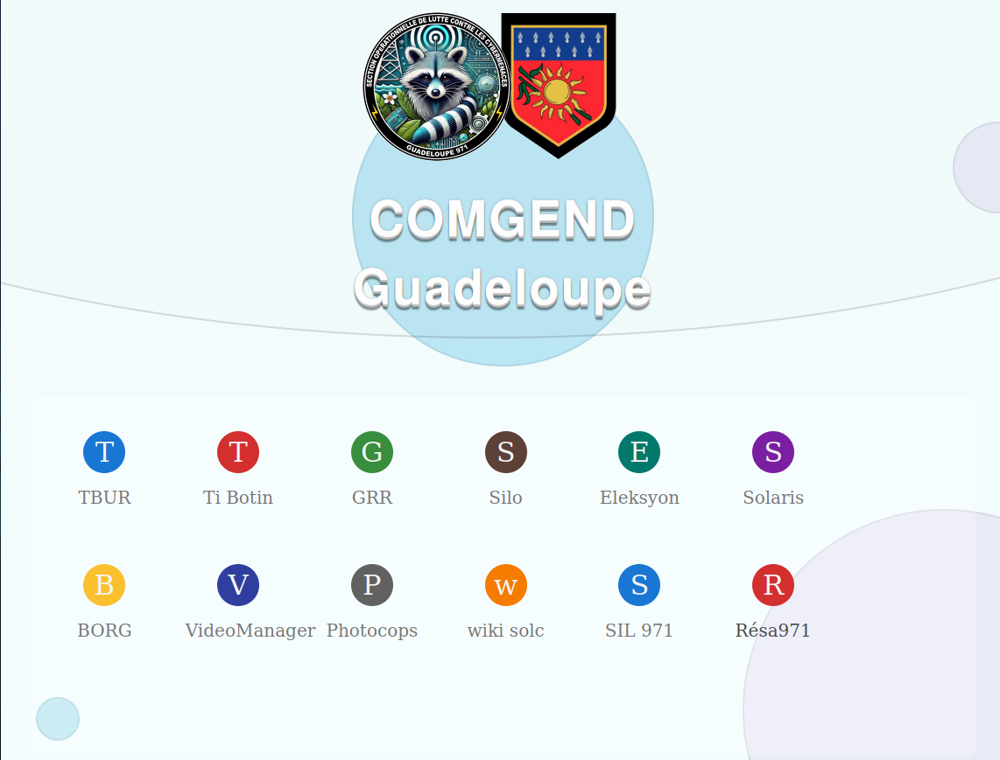
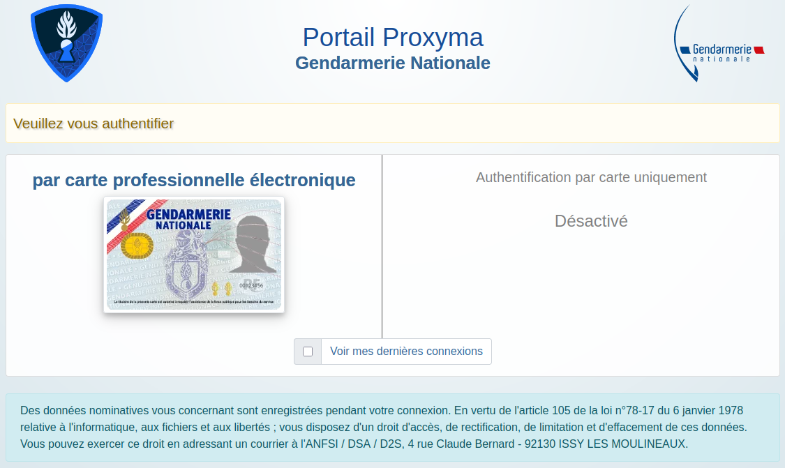
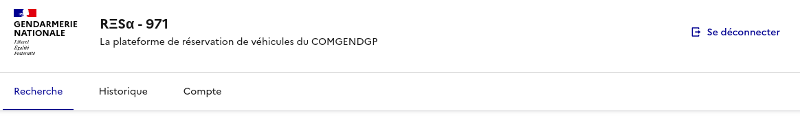
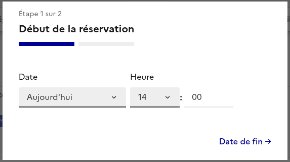
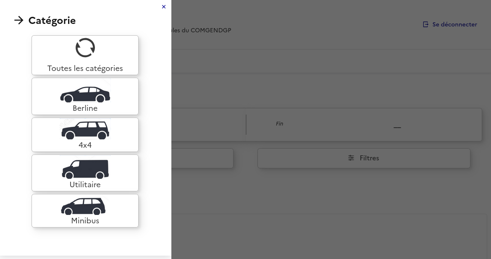
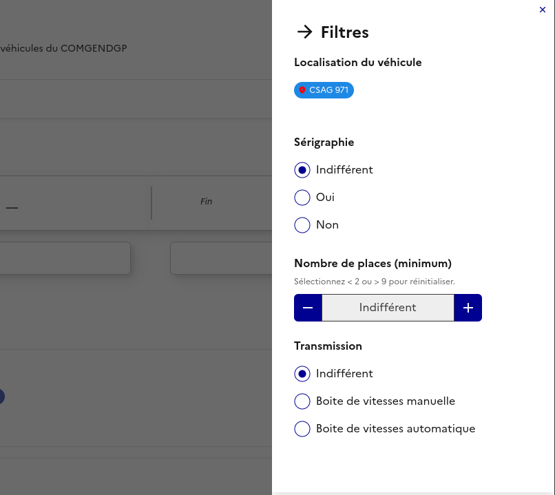

# R&#926;S&#945; 971 | Réservation de véhicule en Ligne

## Description

Grâce à votre action quotidienne, le parc automobile de la Gendarmerie Nationale s'enrichie des véhicules saisis aux délinquants.

En retour, la Gendarmerie a choisi de mettre ces véhicules à votre disposition, afin de faciliter la réalisation de vos différentes missions, qu'elles soient d'ordre opérationel ou non.

Ce guide a pour but de vous accompagner dans l'utilisation du site internet de réservation, sur lequel vous pourrez également trouver les véhicules mis à votre disposition par notre CSAG. 

## Périmètre de réservation

Le périmètre de réservation pour le pool de véhicules est fonction de l'unité bénéficiaire. 
- Ainsi, votre **compagnie**, **SR**, **EDCF** ou **AGIGN** procèdera, à votre profit, à la réservation d'un véhicule si votre unité fait partie de son périmètre ou si votre cellule / groupe d'enquête y est rattaché.
- Les personnels des unités **MPF**, **GIR** et **BGTA** sont autonomes pour procéder à des réservations.
- Enfin, les personnels des unités SOLC, SAJ et BOE devront s'adresser à la **SAJ** ou à l'**OAPJR 1 et 2** pour leurs réservations.

Par conséquent, vous rencontrerez peut-être un message d'erreur si vous essayez de vous connecter directement au site et que vous n'êtes pas autorisés à procéder aux réservations par vous-même. 

## Adresse de connexion au site (URL)

La SOLC Saint-Claude et le DSOLC Baie-Mahault ont réalisé un portail regroupant les différents sites locaux réservés aux personnels du COMGENDGP.

- Depuis [ce portail](https://comgend971.local.gendarmerie.fr), cliquez sur le lien du site "[Resa971](https://comgend971.local.gendarmerie.fr/resa971)".

- Pour un accès direct, saisissez l'adresse
  [https://comgend971.local.gendarmerie.fr/resa971](https://comgend971.local.gendarmerie.fr/resa971) dans votre navigateur internet Firefox.

## Utilisation selon votre profil utilisateur

Le site compte 4 profils utilisateurs différents:
1. [UTILISATEUR](#utilisation-en-tant-quutilisateur)
2. VALIDEUR
3. CSAG
4. ADMINISTRATEUR (SOLC)

Comme pour la plupart des applications métier de la Gendarmerie, la première action qui vous sera demandée sera de vous connecter via le portail SSO:

Après vous être connecté, et à l'exception du profil "valideur" qui est attribué manuellement par les SOLC/DSOLC, votre profil utilisateur sera déterminé en fonction de l'unité dans laquelle vous servez.

## Quel que soit votre profil

### PAGE D'ACCUEIL

Après vous être connecté, vous accédez à la page d'accueil, toujours accessible via l'onglet "Recherche".

### EN-TÊTE

L'en-tête (Header) du site comprend **le nom du site**, sur lequel vous pouvez cliquer à tout moment pour revenir à l'accueil.

Vous trouverez aussi, en haut à droite, un **bouton de déconnexion**.

Dessous, trois onglets:

- onglet **Recherche** (page d'accueil),
- onglet **Historique**: pour retrouver vos demandes de réservation, passées ou à venir,
- onglet **Compte**: pour retrouver toutes les actions possibles sur le site, en focntion de votre profil.

### FILTRES DE RECHERCHE

Dans la partie principale (Main) de la page, vous trouverez des filtres de recherche, vous permettant de cibler un véhicule particulier:

#### Filtres de **début** et de **fin**: 

Attention, ces filtres ne vous permettent pas de réserver un véhicule à une date particulière! Leur utilisation vous permet de ***trouver un véhicule qui n'est pas réservé*** pendant la période que vous définissez.
  
#### Filtre de catégorie:

Selon les types de carrosseries disponibles, ce filtre vous permettra de trouver le véhciule le plus adapté à votre mission.

#### Autres filtres

Vous pouvez rechercher selon des criètes plus spécifiques, tes que:
- l'unité où est localisé le véhicule,
- la présence d'une **sérigraphie** ou non,
- le **nombre de places minimum** que doit compter le véhicule,
- le type de **transmission**.

## Utilisation en tant qu'utilisateur

### Choix d'un véhicule

Comme vous pouvez le voir, chaque véhicule proposé à la réservation apparaît sous la forme d'une carte.

Vous trouverez sur chaque carte:
- la photo du véhicule,
- la marque et le modèle,
- la finition ou des caractéristiques techniques majeures
- 3 tags décrivant:
    - l'unité où se trouve le véhicule,
    - le type de transmission (automatique ou manuelle)
    - le type de carburant
- plusieurs symboles pour connaître le nombre de places à bord (autant de "petits bonhommes" que de places).

### Page de réservation

Après avoir cliqué sur la carte du véhicule de votre choix, sa page de réservation dédiée s'affiche.

Cette page vous présente davantage de photos du véhicule s'il y en a, des caractéristiques plus détaillées et surtout: un **calendrier de réservation**.

#### Processus de réservation

1. Cliquez sur la date à laquelle vous voulez que votre réservation débute:

2. Une fenêtre surgissante (modale)
 s'ouvre afin de sélectionner l'heure de début de la réservation. Le choix des heures proposé tient compte des horaires du CSAG.

3. Cliquez sur la date à laquelle vous voulez que votre réservation se termine, puis renseignez l'heure de restitution:

4. Le récapitulatif des dates de début et de fin de réservation a été mis à jour en fonction de vos choix. Cliquez sur le bouton "**Je réserve**" pour confirmer votre demande.

5. Une dernière modale s'ouvre alors, et vous invite à préciser:
    - l'usage que vous comptez faire du véhicule (opérationnel ou non),
    - vos observations. Ce champs est facultatif mais il permettra à votre valideur d'apprécier l'opportunité de votre demande. Il vous appartient donc d'être exhaustif!

6. Après avoir confirmé votre demande, une page vous indique que celle-ci est désormais en **attente de validation**.

#### Attente de validation

À ce stade, votre demande de réservation a bien été enregistrée et le véhicule demandé n'est plus proposé aux autres utilisateurs.

**Toutefois**, tant que votre demande n'a pas été validée, le véhicule ne vous est pas réservé. Bien qu'il n'apparaisse plus comme disponible aux dates que vus avez demandées, le valideur peut l'attribuer à quelqu'un d'autre, et peut même annuler complètement votre demande!

**RENDEZ-VOUS DANS L'ONGLET "HISTORIQUE" POUR SUIVRE L'ÉVOLUTION DE VOTRE DEMANDE. CELLE-CI DEVRAIT PASSER DU STATUT "EN ATTENTE" À "VALIDÉE".**

#### Demande de réservation validée

Si votre demande a été validée, le véhicule vous est réservé et sera disponible à la date et l'heure de début prévue, dans la cour du CSAG. 

- Les clés seront perçues et réintégrées au CSAG,
- Les véhciules d eprêt doivent être correctement entretenus par l'unité bénéficiaire, et l'entretien de premier niveau doit être réalisé avant restitution,
- Les véhicules doivent être restitués propres pour pouvoir être perçus dans le même état par l'unité suivante, avec le plein de carburant effectué.

À défaut, la réintégration  sera refusée et l'unité en cause devra réaliser l'entretien dans les locaux du CSAG le jour même. Une récurrence de défaut d'entretien pourra conduire à une exclusion temporaire de l'accès au pool.

## Licence

Le site R&#926;S&#945; 971 utilise le <abbr title="Système de Design de l'État">DSFR</abbr>&copy;, qui est [sous licence ouverte Etalab 2.0](https://www.etalab.gouv.fr/wp-content/uploads/2017/04/ETALAB-Licence-Ouverte-v2.0.pdf). 

La license utilisée par le <abbr title="Système de Design de l'État">DSFR</abbr>&copy; autorise la réutilisation libre de son code, sous réserve que cette réutilisation ne profite exclusivement qu'à un service ou une administration de l'Etat.

En réutilisant le code de R&#926;S&#945; 971 pour vos propres besoins, vous vous engagez à respecter la license Etalab 2.0, ou à retirer tout code faisant appel au DSFR&copy;.

Par ailleurs, bien que ce site a été conçu dès le départ pour pouvoir être réutilisé par n'importe quel autre groupement, région ou COMGEND, des règles d'utilisation propres à notre territoire ont été ajoutées. De fait, elles demanderont probablement une adaptation à vos propres règles locales si vous souhaitez mettre en oeuvre R&#926;S&#945; 971 au sein de votre département.

## Contact
Pour toute question ou suggestion, contactez la SOLC Saint-Claude (code unité 12238) ou le DSOLC Baie-Mahault (code unité 86977)